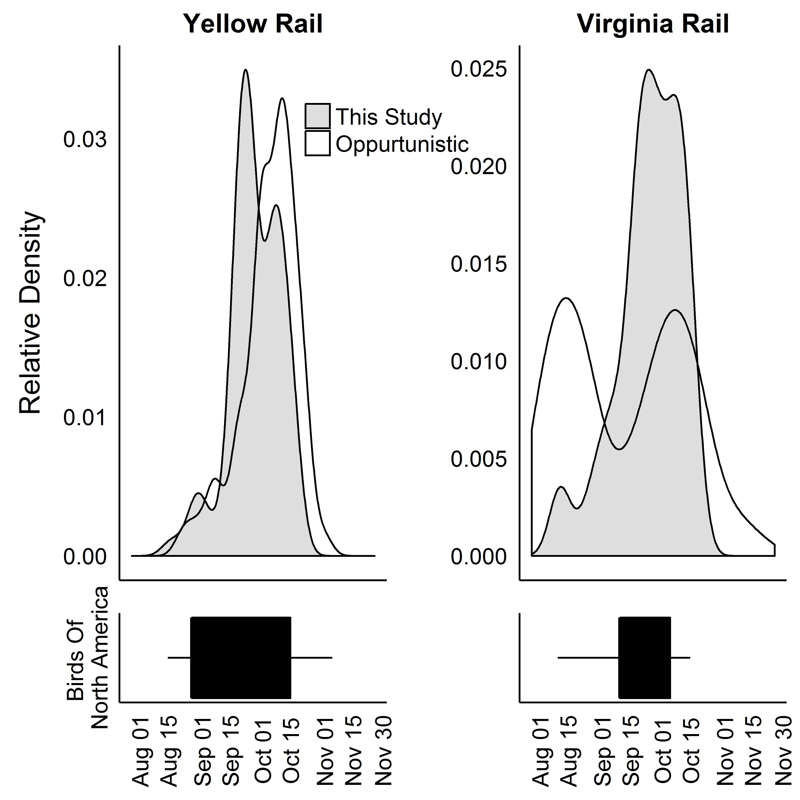

One of the challenges of working with rails is we know so little about them, and what we do know is often scattered in small data points here from the 1960s, and here from the 2000s. There is little data that has been collected in a deliberate way over a long period. The first place I looked was The Birds of North America, which provides detailed species accounts for each species. These graphs showed me some data, with literal question marks on it, that didn't provide a lot of guidance as to when Virginia Rails were migrating (Conway 1995)

As a result of these fairly uninformative graphs I often end up digging into some literature to find data. Over the past two years I've tracked down almost all the issues of The Bluebird, journal of the Audubon Society of Missouri, and compiled all the spring and autumn migration data contained therein [Data available here on figshare](https://figshare.com/articles/The_Bluebird_Rail_Data/2760913). These data are opportunistic at best (someone saw a rail, and decided to report it) but when looking at pre-eBird times (eBird being a very large online database of citizen science bird observations, which really took over after 2000) these kind of state by state resources can be vital. 

I targeted Missouri because that is where my own field work takes place and I was seeking data to compare to my own. In five years and over 1000 hours of surveys I hadn't seen very many Yellow or Virginia Rails (<100 in each case). This made quantifying their migration difficult especially because I am assuming some level of year to year variability in migration, which is common among birds. 

So I sought out this other data, from the state Audubon Society. I also downloaded all August-November eBird.org observations for Missouri, Illinois, Indiana, Kentucky and Ohio (roughly the same latitude as Missouri and within the same [adminsitrative flyway](https://www.fws.gov/birds/management/flyways.php)). These represent another type of opportunistic data, where members of the public go out birding, record what they see, and submit their observations. More data points were available here but eBird data can be biased because people tend to bird where they live, meaning effort is not evenly distributed across the landscape. So I sought out a third type of data, building strikes. 

When I tell people rails hit buildings they are often surprised, but many many bird species have been recorded striking buildings. Many species of birds migrate at night and the lights on tall structures in large cities (and even in less urban situations) can disorient them and lead to collisions. In many large cities there are building strike monitoring programs where people walk the same route each morning and record what is found on the sidewalk (in many cases the dead birds are also collected and given to a museum, YAH MUSEUMS!). These data could be another interesting source since they are being collected each day in the same place, though this is only occurring in large cities. I obtained these data points from Loss et al (2014), Thanks Scott!

So I have these three kinds of data, and my own data, and I want to figure out what on earth they can tell me about the migration of two of the least studied birds in North America.

I thought about doing this a few different ways, first trying histograms, and line graphs, even scatter plots. None of these seemed to work. All the sample sizes were different and whatever the story was it was lost. 

Then I tried box plots, with the idea this would help take out the highly variable y axis due to different sample sizes, and allow us to compare the duration and median date of migration. 

This was ok. I only had one data point for building strikes of Yellow Rails, so I excluded it, and this figure is fine. But I wasn't really happy with it, I was still wrestling back and forth with if I should be describing each data type on its own, or if they should all be lumped together, and I found this graph deceptive, it did a good job of making it clearer because the sample size was hidden, but that hidden element bugged me.

| Data Type        | Yellow Rail | Virginia Rail | Citation                         |
|------------------|-------------|---------------|----------------------------------|
| The Bluebird     | 20          | 20            | (Fournier 2016)                  |
| eBird            | 53          | 261           | (Sullivan et al. 2009)           |
| Building Strikes | 1           | 3             | (Loss et al. 2014)               |
| My Surveys       | 77          | 114           | Fournier et al. Unpublished Data |

So I tried some other methods, again and again. 

Finally I settled on this one. 

This graph does a few things I really like. It separates out the Birds of North America data, which isn't really data so much as my visualization of the information on the graph in the Birds of North American Accounts. It also lumps the data in a way I am comfortable with. All the data I gathered from other sources, Audubon Society of Missouri, eBird and the building strike data, are lumped into 'Opportunistic Observations' which I think is the most conservative way of looking at them. My data, which were collected through nightly regular surveys are separated for two main reasons 1) they are my data and I wanted to compare my data to other data, 2) they were collected under one standardized protocol, unlike the other data types. 

I think this data does a better job of showing the story. Yellow Rail migration, in my study and in the opportunistic data is occurring in two strong peaks which are near each other. Why they aren't the same could be related to a variety of biases and assumptions in the data set. These also overlap well with the Birds of North America account range though they start earlier, which could be a big deal. 

Virginia Rail migration is clearly a different beast. Opportunistic observations have two peaks, one of which strongly overlaps with my data, and migration is starting earlier and continuing much later than it does in the Birds of North America Account. 

One thing I don't like about this figure is I don't have a good way of showing the yearly variation in the data, which is probably asking too much of what is still a pretty limited data set, but a ornithologist can dream! 

I'm still working on this manuscript, and still trying to decide if this is the best way to visualize this kind of data. If you have ideas I'd love to hear them, aurielfournier@gmail.com or @RallidaeRule. 

## Citations 

Conway, Courtney J. (1995). Virginia Rail (Rallus limicola), The Birds of North America (P. G. Rodewald, Ed.). Ithaca: Cornell Lab of Ornithology; Retrieved from the Birds of North America: https://birdsna.org/Species-Account/bna/species/virrai
DOI: 10.2173/bna.173

Fournier, Auriel (2016): The Bluebird Rail Data. figshare.
https://dx.doi.org/10.6084/m9.figshare.2760913.v2
Retrieved: 21 50, Dec 05, 2016 (GMT)

Loss, S. R. S. S., T. Will, P. P. Marra, S. R. S. S. Loss, and P. P. Marra. 2014. Bird–building collisions in the United States: Estimates of annual mortality and species vulnerability. Condor 116:8–23. <http://www.bioone.org/doi/abs/10.1650/CONDOR-13-090.1%5Cnhttp://dx.doi.org/10.1650/CONDOR-13-090.1>.

Sullivan, B. L., C. L. Wood, M. J. Iliff, R. E. Bonney, D. Fink, and S. Kelling. 2009. eBird: A Citizen-based Bird Observation Network in the Biological Sciences. Biological Conservation 142:2282–2292.

